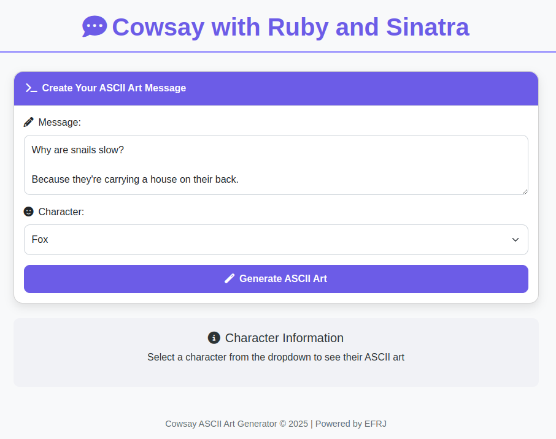

# Cowsay Web App

## Instructions in English

This project is a simple Sinatra-based web application that uses the `cowsay` program to generate text messages with ASCII characters. The user can provide a message and select a character. The application then displays the message generated by `cowsay` with the chosen character.

## Prerequisites

- Ruby 2.7 or higher
- Bundler
- Cowsay (For running locally without Docker. Check how to install Cowsay on your Linux distribution or see more information on the official website: https://cowsay.diamonds)

## Running the project without Docker

1. Clone the repository:

git clone https://github.com/your-username/cowsay-webapp.git

``cd cowsay-webapp``

2. Copy the .env-example file and save as .env

``cp .env-example .env``
 
3. Build the Docker image:

``docker-compose build``

4. Run the container:

``docker-compose up``

5. Access the application in your browser at [http://localhost:4567](http://localhost:4567). 

## Running the project with Docker

1. Clone the repository:

git clone https://github.com/your-username/cowsay-webapp.git

``cd cowsay-webapp``

 
2. Build the Docker image:

``docker-compose build``

3. Run the container:

``docker-compose up``

4. Access the application in your browser at [http://localhost:4567](http://localhost:4567).

## Personalization

If you want to map port 4567 to another port when running the project with Docker, modify the value of the `PORT_MAPPING` variable in the `.env` file. For example, to map port 4567 to port 8080, change the value to `PORT_MAPPING=8080`.

## License

This project is licensed under the MIT License - see the [LICENSE](LICENSE) file for details.

## Instruções em Português

Este projeto é uma aplicação web simples baseada no Sinatra que utiliza o programa `cowsay` para gerar mensagens de texto com personagens ASCII. O usuário pode fornecer uma mensagem e selecionar um personagem. A aplicação, então, exibe a mensagem gerada pelo `cowsay` com o personagem escolhido.

## Pré-requisitos

- Ruby 2.7 ou superior
- Bundler
- Cowsay (Para execução local sem Docker. Verifique como instalar o Cowsay na sua distribução Linux ou veja mais informações no site oficial: https://cowsay.diamonds)

## Executando o projeto sem Docker

1. Clone o repositório:

git clone https://github.com/your-username/cowsay-webapp.git 

Entre no diretório:

``cd cowsay-webapp``

2. Instale as dependências: 

``bundle install`` 

3. Execute a aplicação: 

``ruby app.rb`` 

4. Acesse a aplicação em seu navegador em [http://localhost:4567](http://localhost:4567). 

## Executando o projeto com Docker 

1. Clone o repositório: 

git clone https://github.com/your-username/cowsay-webapp.git 

``cd cowsay-webapp`` 

2. Copie o arquivo .env-example e salve como .env 

``cp .env-example .env``
 
3. Construa a imagem do Docker: 

``docker-compose build`` 

4. Execute o contêiner: 

``docker-compose up`` 

5. Acesse a aplicação em seu navegador em [http://localhost:4567](http://localhost:4567). 

## Personalização 

Se você deseja mapear a porta 4567 para outra porta ao executar o projeto com Docker, modifique o valor da variável `PORT_MAPPING` no arquivo `.env`. Por exemplo, para mapear a porta 4567 para a porta 8080, altere o valor para `PORT_MAPPING=8080`.

## Licença

Este projeto está licenciado sob a Licença MIT - consulte o arquivo [LICENSE](LICENSE) para obter detalhes.
